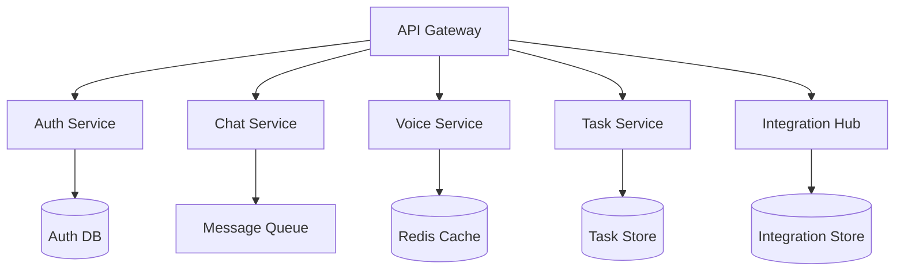

# Technical Implementation Plan for Scaling

## Infrastructure Improvements

### 1. Microservices Architecture



#### Implementation Priority
1. Split monolithic app into services
2. Implement API gateway
3. Set up message queues
4. Deploy service mesh

### 2. Database Scaling

```sql
-- Implement database sharding
CREATE TABLE messages_YYYYMM (
    LIKE messages INCLUDING DEFAULTS,
    CHECK (created_at >= DATE 'YYYY-MM-01' AND created_at < DATE 'YYYY-MM-01' + INTERVAL '1 month')
) PARTITION BY RANGE (created_at);

-- Add performance indexes
CREATE INDEX idx_messages_thread_id ON messages(thread_id);
CREATE INDEX idx_messages_user_id ON messages(user_id);
CREATE INDEX idx_messages_created_at ON messages(created_at);
```

#### Optimization Steps
1. Implement table partitioning
2. Set up read replicas
3. Add caching layer
4. Optimize indexes

### 3. Real-time System Scaling

```typescript
// WebSocket connection pooling
interface ConnectionPool {
  maxConnections: number;
  currentConnections: number;
  pools: Map<string, WebSocket[]>;
  
  addConnection(userId: string, ws: WebSocket): void;
  removeConnection(userId: string, ws: WebSocket): void;
  broadcast(message: any): void;
}

// Message queue integration
interface MessageQueue {
  publish(topic: string, message: any): Promise<void>;
  subscribe(topic: string, handler: (message: any) => void): void;
  unsubscribe(topic: string): void;
}
```

#### Implementation Steps
1. Implement connection pooling
2. Set up message queues
3. Add real-time monitoring
4. Implement auto-scaling

### 4. Caching Strategy

```typescript
interface CacheConfig {
  // Global cache settings
  globalTTL: number;
  maxSize: number;
  
  // Per-resource settings
  resources: {
    [key: string]: {
      ttl: number;
      maxSize: number;
      invalidationStrategy: 'time' | 'size' | 'both';
    }
  };
}

// Implementation example
const cacheConfig: CacheConfig = {
  globalTTL: 3600, // 1 hour
  maxSize: 1000000, // 1M items
  resources: {
    'user-preferences': {
      ttl: 86400, // 24 hours
      maxSize: 100000,
      invalidationStrategy: 'both'
    },
    'chat-messages': {
      ttl: 300, // 5 minutes
      maxSize: 500000,
      invalidationStrategy: 'time'
    }
  }
};
```

## Performance Optimization

### 1. API Response Time

```typescript
// API response time monitoring
interface APIMetrics {
  endpoint: string;
  method: string;
  responseTime: number;
  status: number;
  timestamp: Date;
}

// Implementation
const monitorAPI = async (req: Request, res: Response, next: NextFunction) => {
  const start = Date.now();
  
  res.on('finish', () => {
    const metrics: APIMetrics = {
      endpoint: req.path,
      method: req.method,
      responseTime: Date.now() - start,
      status: res.statusCode,
      timestamp: new Date()
    };
    
    // Send metrics to monitoring system
    MetricsService.record(metrics);
  });
  
  next();
};
```

### 2. Resource Optimization

```typescript
// Resource pooling
interface ResourcePool<T> {
  acquire(): Promise<T>;
  release(resource: T): void;
  status(): {
    available: number;
    total: number;
    waiting: number;
  };
}

// Implementation for database connections
class DatabasePool implements ResourcePool<Connection> {
  private pool: Connection[] = [];
  private waiting: ((conn: Connection) => void)[] = [];
  
  async acquire(): Promise<Connection> {
    if (this.pool.length > 0) {
      return this.pool.pop()!;
    }
    
    return new Promise((resolve) => {
      this.waiting.push(resolve);
    });
  }
  
  release(conn: Connection): void {
    if (this.waiting.length > 0) {
      const waiter = this.waiting.shift()!;
      waiter(conn);
    } else {
      this.pool.push(conn);
    }
  }
}
```

## Security Enhancements

### 1. Authentication

```typescript
interface AuthConfig {
  // JWT configuration
  jwt: {
    algorithm: string;
    expiresIn: string;
    issuer: string;
    audience: string;
  };
  
  // Rate limiting
  rateLimit: {
    window: number;
    max: number;
  };
  
  // Session management
  session: {
    maxAge: number;
    renewThreshold: number;
  };
}

// Implementation
const authConfig: AuthConfig = {
  jwt: {
    algorithm: 'RS256',
    expiresIn: '1h',
    issuer: 'ultrachat',
    audience: 'ultrachat-api'
  },
  rateLimit: {
    window: 900000, // 15 minutes
    max: 100
  },
  session: {
    maxAge: 86400000, // 24 hours
    renewThreshold: 3600000 // 1 hour
  }
};
```

### 2. Data Protection

```typescript
// Encryption service
interface EncryptionService {
  encrypt(data: any): Promise<string>;
  decrypt(encrypted: string): Promise<any>;
  rotateKey(): Promise<void>;
}

// Implementation
class AESEncryptionService implements EncryptionService {
  private readonly algorithm = 'aes-256-gcm';
  private currentKey: Buffer;
  
  async encrypt(data: any): Promise<string> {
    const iv = crypto.randomBytes(12);
    const cipher = crypto.createCipheriv(this.algorithm, this.currentKey, iv);
    
    let encrypted = cipher.update(JSON.stringify(data), 'utf8', 'hex');
    encrypted += cipher.final('hex');
    
    return iv.toString('hex') + ':' + encrypted + ':' + cipher.getAuthTag().toString('hex');
  }
  
  // ... decrypt and rotateKey implementations
}
```

## Monitoring System

```typescript
interface Metrics {
  // System metrics
  system: {
    cpu: number;
    memory: number;
    disk: number;
  };
  
  // Application metrics
  app: {
    activeUsers: number;
    requestsPerSecond: number;
    errorRate: number;
  };
  
  // Business metrics
  business: {
    activeSubscriptions: number;
    revenue: number;
    churn: number;
  };
}

// Implementation
class MetricsCollector {
  private metrics: Metrics;
  private readonly interval: number;
  
  constructor(interval: number = 60000) {
    this.interval = interval;
    this.startCollection();
  }
  
  private async startCollection() {
    setInterval(async () => {
      this.metrics = await this.collectMetrics();
      await this.sendToMonitoring();
    }, this.interval);
  }
  
  private async collectMetrics(): Promise<Metrics> {
    // Implement metrics collection
    return {
      system: await this.collectSystemMetrics(),
      app: await this.collectAppMetrics(),
      business: await this.collectBusinessMetrics()
    };
  }
}
```

## Implementation Timeline

### Week 1-2: Infrastructure Setup
- Deploy microservices architecture
- Set up database sharding
- Implement caching layer

### Week 3-4: Performance Optimization
- Implement connection pooling
- Set up message queues
- Deploy monitoring system

### Week 5-6: Security Implementation
- Enhance authentication system
- Implement encryption service
- Set up audit logging

### Week 7-8: Testing and Deployment
- Load testing
- Security testing
- Gradual rollout

## Success Metrics

### Technical KPIs
- API Response Time: < 100ms
- System Uptime: 99.99%
- Error Rate: < 0.01%
- Cache Hit Rate: > 90%

### Business KPIs
- User Concurrency: 100k+
- Message Processing: 1M+/hour
- Data Processing: 10TB+/day
- Real-time Connections: 50k+